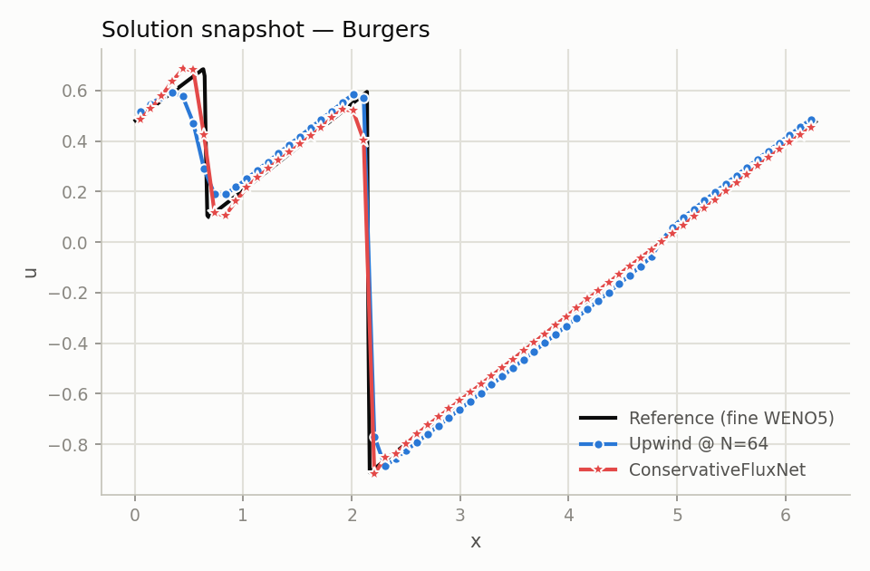
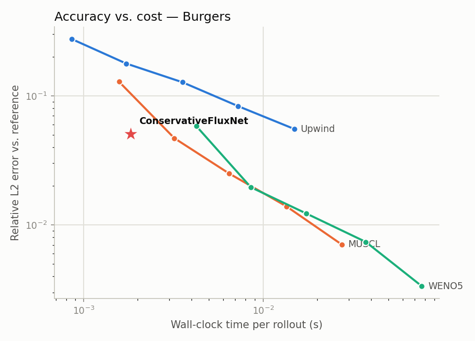

# neuralfv — Neural Flux-Conservative PDE Solver

A hybrid machine-learning / finite-volume PDE solver: a small convolutional
network predicts numerical fluxes at cell interfaces instead of the next
state directly, so **mass conservation is exact by construction** — proven
on a randomly-initialized, *untrained* network, not just observed after
training. Combined with multi-step rollout training and noise injection, the
trained network takes timesteps several times past the classical CFL limit
while staying competitive with high-order classical solvers on accuracy per
unit of wall-clock time.

This is a from-scratch rebuild and modernization of an earlier "cell-average
based neural networks" research collaboration, done in PyTorch (previous
work used TensorFlow/Keras) with a real architectural upgrade: **predict
fluxes, not states.**



## The core idea

Standard finite-volume schemes update a cell average `u_i` from the
divergence of numerical fluxes at its interfaces:

```
u_i^{n+1} = u_i^n - (dt/dx) * (F_{i+1/2} - F_{i-1/2})
```

`ConservativeFluxNet` ([`src/neuralfv/solvers/neural/flux_net.py`](src/neuralfv/solvers/neural/flux_net.py))
learns `F` — a stencil convolution over neighboring cell averages — instead
of learning the state update directly. Because every predicted flux is added
to one cell and subtracted from its neighbor, total mass is invariant under
this update for *any* network weights, including a fresh random
initialization:
[`tests/test_flux_net_conservation.py`](tests/test_flux_net_conservation.py)
proves it directly.

Multi-step rollout training with noise injection
([`src/neuralfv/solvers/neural/rollout.py`](src/neuralfv/solvers/neural/rollout.py))
then teaches the network to be self-correcting under its own compounding
error, which is what makes "many steps past the CFL limit" a real, stable
claim rather than a one-step curiosity — both trained models below hold up
well past their training horizon (verified out to 60 large steps against an
8-step training curriculum).

## Results

Benchmarked against classical upwind, MUSCL, and WENO5 finite-volume solvers
(all implemented from scratch — [`src/neuralfv/solvers/classical/`](src/neuralfv/solvers/classical/)),
averaged over 6 held-out test initial conditions:

| PDE | Effective CFL number | Rel. L2 error vs. reference | Speedup vs. WENO5 at matched accuracy |
|---|---|---|---|
| Linear advection | **4.1x** classical limit | 4.8% | **5.5x** |
| Burgers' (shock-forming) | **3.6x** classical limit | 5.1% | **2.5x** |

*"Speedup at matched accuracy" interpolates the WENO5 resolution sweep to
find the wall-clock cost of matching the network's accuracy, then divides by
the network's own wall-clock cost.*

**Conservation:** the trained Burgers network's mass drift stays ~`2e-8`
over the full rollout — this is the float32 round-off floor (the classical
solvers run in float64, at ~`1e-16`), not a training artifact. Conservation
error is ~8 orders of magnitude smaller than the ~5% solution error: exact
for any practical purpose. See
[`docs/report/figures/burgers_conservation.png`](docs/report/figures/burgers_conservation.png).



The network's (time, error) point sits to the left of every classical
scheme's curve at comparable accuracy — cheaper than upwind at any accuracy
level it reaches, and competitive with MUSCL/WENO5 at their low-resolution
end while running far fewer, far larger timesteps.

More figures (advection, error growth over the rollout, conservation drift)
are in [`docs/report/figures/`](docs/report/figures/), all reproducible via
the commands below. Full write-up: [`docs/report/report.md`](docs/report/report.md).
Interactive demo: `demo/web/` (see [Interactive demo](#interactive-demo)).

## Quickstart

```bash
python3 -m venv .venv && source .venv/bin/activate
pip install -e ".[dev]"

# Train (writes outputs/*.pt + a training-curve log)
python -m neuralfv.training.train --config src/neuralfv/training/configs/advection_cfn.yaml
python -m neuralfv.training.train --config src/neuralfv/training/configs/burgers_cfn.yaml

# Benchmark against classical solvers + regenerate every figure/number above
python -m neuralfv.evaluation.benchmark

# Tests (includes the conservation proof and a training smoke test)
ruff check src tests
PYTHONPATH=src pytest
```

## Repo layout

```
src/neuralfv/
  pdes/               linear advection, Burgers' equation
  solvers/classical/  upwind, Lax-Friedrichs, MUSCL, WENO5 -- shared reconstruction + SSP-RK3 skeleton
  solvers/neural/     ConservativeFluxNet, rollout training, losses
  data/               synthetic data generation (fine WENO5 truth, block-averaged to coarse cadence)
  training/           config-driven training entrypoint + YAML configs
  evaluation/         benchmark metrics, the full evaluation script, plotting
tests/                classical-solver convergence + conservation, flux-net conservation proof,
                      rollout shape/gradient checks, a training smoke test
demo/web/             interactive NN-vs-classical solver visualization (precomputed payloads)
docs/report/          technical write-up + all figures
```

## Interactive demo

`demo/web/index.html` is a static page comparing the trained network against
classical baselines, scenario by scenario, using precomputed trajectories
(not live in-browser inference — see [`docs/report/report.md`](docs/report/report.md#demo-design)
for why). Generate the payloads and serve it locally:

```bash
PYTHONPATH=src python demo/export_demo_payloads.py
python -m http.server --directory demo/web 8000
```

## Limitations & future work

- Benchmarks are 1D (linear advection, scalar Burgers). A system of
  conservation laws (e.g. shallow-water) and a neural-operator (FNO)
  comparison baseline are natural next steps — see
  [`docs/report/report.md`](docs/report/report.md#limitations--future-work).
- Wall-clock comparisons are single-CPU, un-batched, pure-Python/PyTorch —
  real speedup headroom (GPU batching across many trajectories, larger
  grids) is discussed in the write-up rather than claimed here.

## License

MIT — see [LICENSE](LICENSE).
